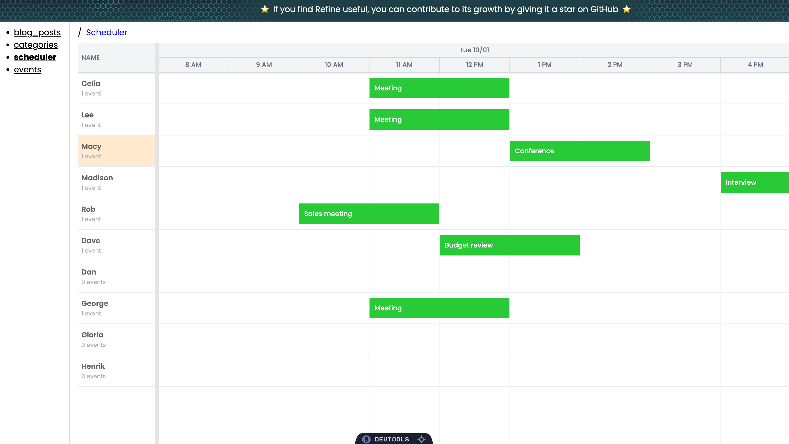

# Create a Bryntum Scheduler component in a Refine application using Next.js

This [Refine](https://github.com/refinedev/refine) project was generated using the [Refine CLI-based Scaffolder](https://github.com/refinedev/refine/tree/master/packages/create-refine-app). The following CLI options were selected:

- **Choose a project template:** Next.js
- **Choose your backend service to connect:** REST API - Installs the REST API data provider
- **Do you want to use a UI Framework?:** Headless - No UI framework
- **Do you want to add example pages?:** Yes
- **Do you need any Authentication logic?:** None

The following code was added to the Next.js template for creating a SQLite database populated with the Bryntum Scheduler data:

- `/src/config/database.ts`: [Sequelize](https://sequelize.org/), a Node.js ORM, and SQLite database configuration.
- `/src/models`:  Sequelize models for the Bryntum Scheduler data.
- `/src/initialData`: Example JSON data for events, resources, and assignments in the Bryntum Scheduler.
- `/src/addExampleData.ts`: Seed script to populate a local SQLite database with example JSON data.

The following npm packages were added:

- `sequelize`
- `sqlite3`

The following Next.js configuration was added to the `next.config.mjs` file:

```js
const nextConfig = {
    experimental : {
        serverComponentsExternalPackages : ['sequelize']
    }
};
```

This removes the `sequelize` package from the Next.js server components bundling, as bundling causes an import error when running the app.

## Getting started

Install the dependencies by running the following command: 

```sh
npm install
```

Populate a local SQLite database with the example scheduler data in `src/initialData`:

```sh
npx tsx ./src/addExampleData.ts
```

## Running the app

Run the local dev server using the following command:

```sh
npm run dev
```

You'll see the template Next.js CRUD app at `http://localhost:3000/` with "Blog posts" and "Categories" pages:


